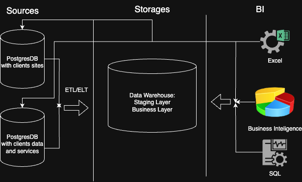

# Homework for Module 1.


## Tasks:
1. Arhitecture of the analytic solution
   
   ```
   It is necessary to draw a high-level architecture for an analytical solution for your company or for a fictional company
   ```

   

2. Analytics use Excel
   
   ```
   Using the data in Sample - Superstore.xls, do the following:

    - Use Lookup
    - Build a PivotTable
    - Build sample reports
    - Create a dashboard
    - And other Excel functionality of your choice.
   ```
