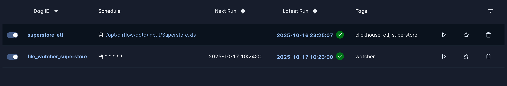
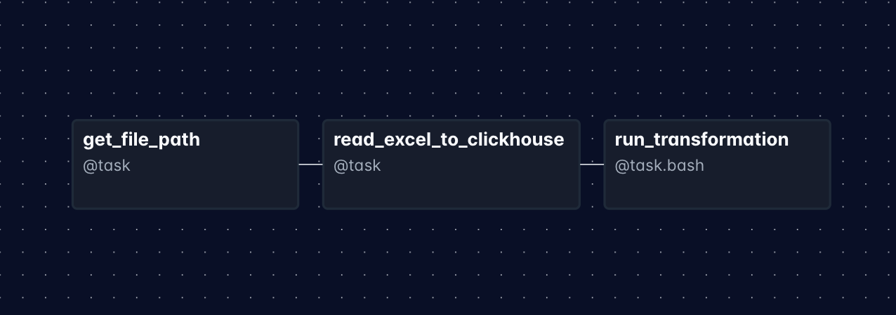
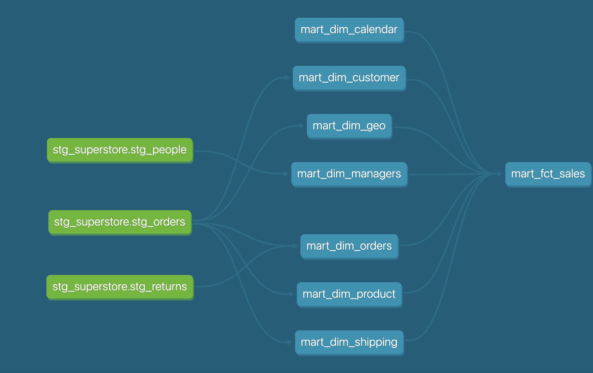
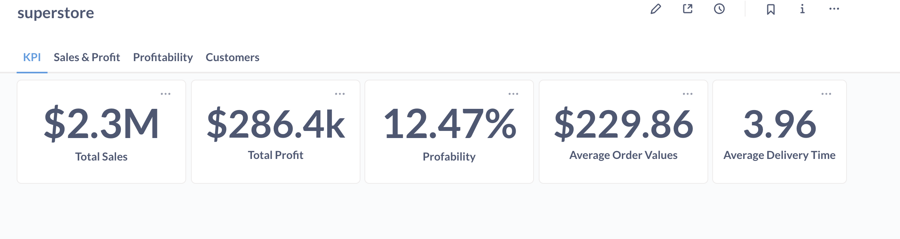
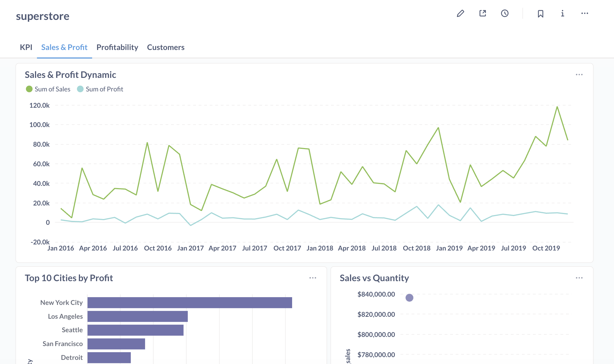
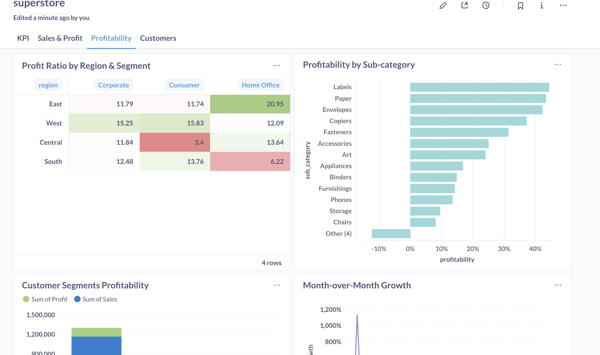
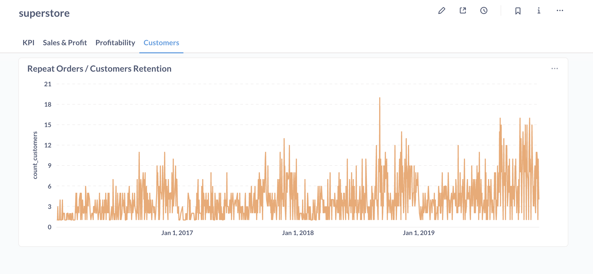

# Homework for Module 4
-----
This module introduce to ETL processes and tools.
-----

## Tasks

1. In this task, I need to complete the Pentaho jobs staging orders and dim_tables, and I should get the same result as in Module 2. I also need to create another transformation for the sales_fact table. 
Pentaho jobs [here](./pentaho_jobs/task1)
-----

2. I need to find 9 ETL subsystems in Pentaho DI and describe their properties.
   You can find overview and screenshots in [etl_subsystems](./etl_subsystems/README.md) 

-----

3. I need to make task from chapter 9 from Pentaho Data Integration Beginner's Guide.
   Result in [pentaho_jobs/task2](./pentaho_jobs/task2/)

-----

4. I need to implement an ETL process for Superstore.xls using Apache Airflow/DBT/Clickhouse/Luigi/Apache NiFi. [Superstore Project](https://github.com/jinjik19/superstore_project.git)

I created two dags. `file_watcher_superstore` - waited file in input folder and run `superstore_etl` DAG. ` superstore_etl` DAG load data from Superstore.xls, transform them and create Data Mart.

`superstore_etl` DAG

DBT models graph

Dashboards
### KPI

### [Sales & Profit](./dashboards/Sales_and_Profit.pdf)

### [Profitability](./dashboards/profitability.pdf)

### Customers

-----

5. Finish dbt lab course (DBT FOUNDAMENTALS + VS Code)
   project here -> [https://github.com/jinjik19/dbt_fundamentals_course.git](https://github.com/jinjik19/dbt_fundamentals_course.git)