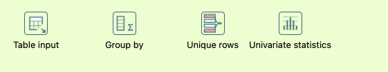
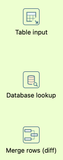
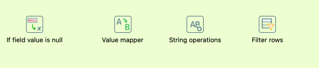
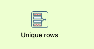
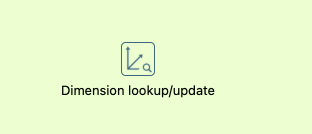
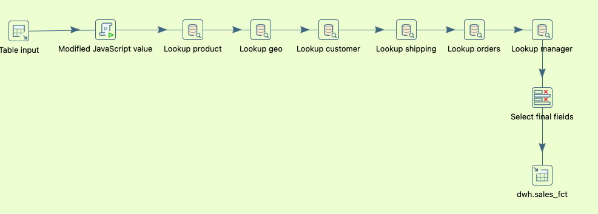
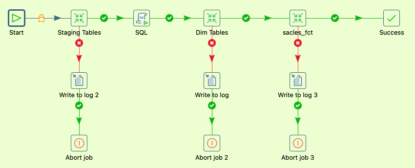

# ETL subsystems in Pentaho DI.
----

## Data Extracting

1. Data Profiling System
   
   `
    This is a collection of of components. This subsystem analyzes data for known structure, quality and anomalies of data.

    - Table Input (or any component from Input) - You can show first N rows.

    - Group By and Unique Rows - You can calculate unique values in column.

    - Univariate statistics - You can calculate min/max, avg, median for number attributes
   `

2. Change Data Capture
   
   `
   This subsystem identifies and extracts from the source only new or updated rows since the last download.

   - Table Input - You can use SQL query like this - `SELECT * FROM source_table WHERE last_modified_data > ?`, where `?` is var with timestamp last successful extract.

   - Merge Rows (diff) or Database lookup - used to compare input data with data already existing in the DW to identify changes.
   `

----

## Cleaning and Conforming Data

3. Data Cleaning System
   
   `
    This subsystem correct errors, fills in gaps and standardizes data.

    - If field value is null - It change `NULL` to specified value

    - Value Mapper - It change one values to other, example "USA" -> "США".

    - String operations - It change the case of letters and removes extra spaces.

    - Filter rows - It filters out rows which you don't need.
   `

----

4. Deduplication System
   
   `
   This subsystem finds and removes complete of partial duplicates rows from data.

   - Unique rows - It removes rows in which the specified set of fields matches completely.
   `

----

## Delivering

5. Surrogate Key Generator
   
   `
   This subsystem change natural/business keys to simple integer keys. It increase performance for `JOIN`.

   - Add sequence - Adds an ascending sequence of numbers to the stream. 
   `

----

6. Slowly Changing Dimension Manager
   
   `
   This is a key subsystem for managing history in measurements.

   - Dimension lookup/update - This step is designed specifically to implement SCD logic. It searches for the key in the table, compares fields, determines whether to update the record (Type 1) or create a new version (Type 2), and manages the start_date, end_date, and is_current fields.
   `

----

7. Fact Table Loader
   
   `
   This subsystem is final stage. We build fact table on this stage.

   In pentaho used as chain of steps:
   Table Input -> Database lookup -> ... -> Table Output
   `

----

## Managing

8. Job Scheduler/Orchestration System
   
   `
   Runs transformations and jobs in the correct sequence (e.g., staging first, then measurements, then facts), manages parallel execution and error handling.

   In Pentaho used as .kjb files with hop
   `

----

9. Error Event Tracking
   
   `
   If something goes wrong during the process (for example, it was not possible to connect to the database or a corrupted file was received), this subsystem intercepts the error, records it in the log, and executes the specified scenario.

   In Pentaho looks like red arrows from step to step. (Arrows to `Write log` step on screenshot) 
   `

----