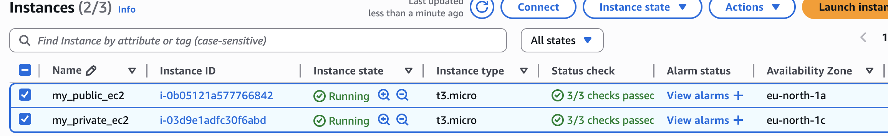
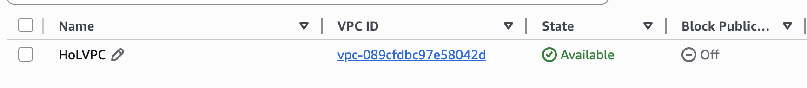
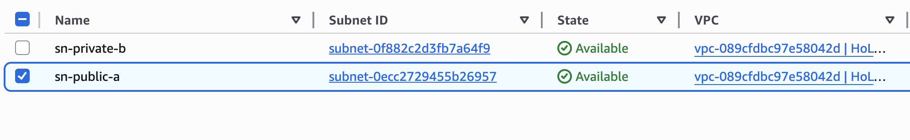
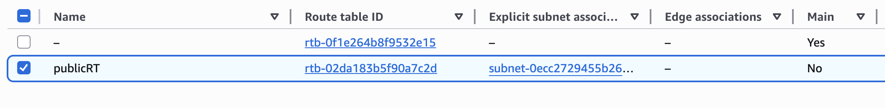
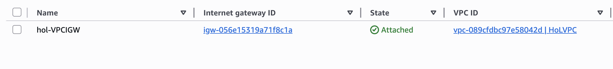
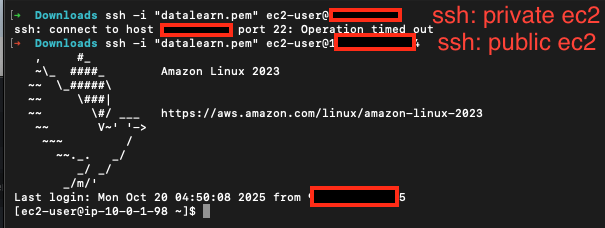

# Homework for Module 5
-----
This module introduce to Cloud Computing.
-----

## Labs

1. I need to create free trial accounts in AWS/Azure, create Virtual Machine, config Security Groups(firewall), connect to Virtual Machine use SSH, create S3 bucket or Storage Account(Azure) and upload Superstore.xls. After that I need to draw architecture for solutions: VPC,Subnet, Internet Gateway, Route Table, Subnet.

AWS:

EC2_INSTANCES:

VPC:

SUBNET:

ROUTE_TABLE:

INTERNET_GATEWAY:

ARCHITECTURE:

Connect to private and public ec2 by ssh:
