# Homework for Module 5
-----
This module introduce to Cloud Computing.
-----

## Labs

1. I need to create free trial accounts in AWS/Azure, create Virtual Machine, config Security Groups(firewall), connect to Virtual Machine use SSH, create S3 bucket or Storage Account(Azure) and upload Superstore.xls. After that I need to draw architecture for solutions: VPC,Subnet, Internet Gateway, Route Table, Subnet.

* [AWS](#aws)
* [Azure](#azure)

AWS:

EC2_INSTANCES:

VPC:

SUBNET:

ROUTE_TABLE:

INTERNET_GATEWAY:

ARCHITECTURE:

Connect to private and public ec2 by ssh:

AZURE:

VNET:
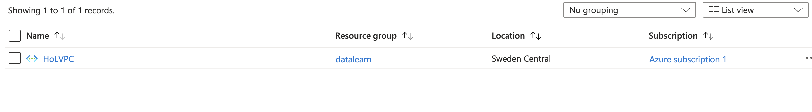

SUBNET:
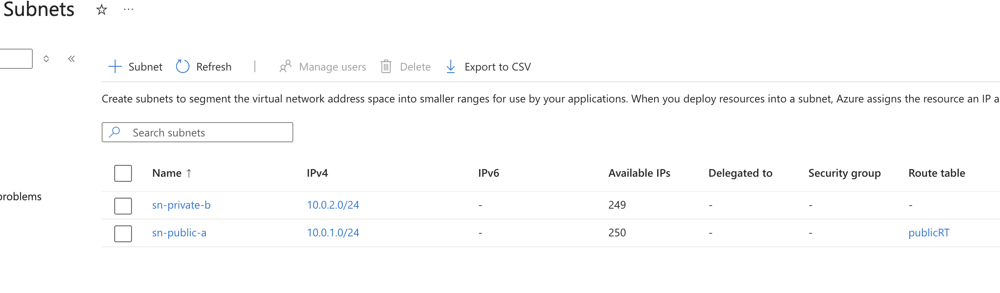

ROUTE_TABLE:
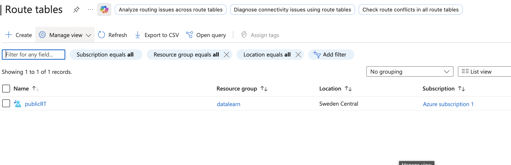

NAT_GATEWAY:
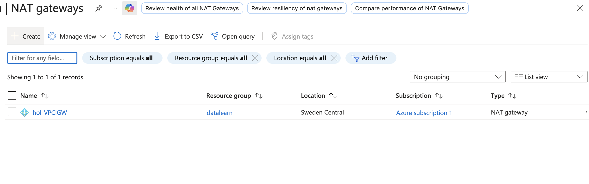

ARCHITECTURE:

Connect to private and public ec2 by ssh:
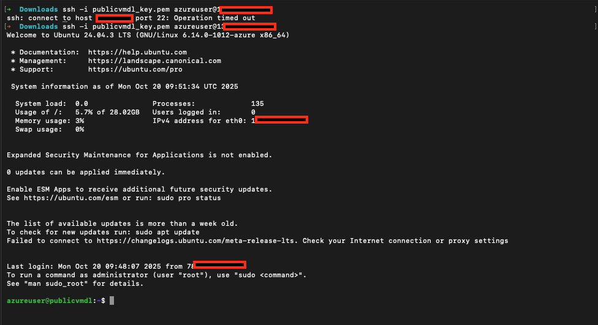

-----

2. I need to create static web site on Amazon S3 and create and work with Azure Blob Storage.
The second part I need to create a Billing Alert in AWS Account. With AWS calculator I need to calculate cost of solutions. And tun template in AWS CloudFormation for any resource. Create two EC2, install apache web server for this servers and connect to Load Balancer. And draw architecture diagram.

- [AWS Static Web site](#aws_static_web_site)
- [Azure Bloc Storage](#azure_blob_storage)
- [AWS Billing Alert](#aws_billing_alert)
- [AWS Pricing Calculator](#aws_pricing_calculator)
- [First AWS CloudFormation Template](#fist_cloudfromation_template)
- [AWS EC2 Instances with Load Balancer](#ec2_instances_with_load_balancer)

AWS Static Web site

Bucket
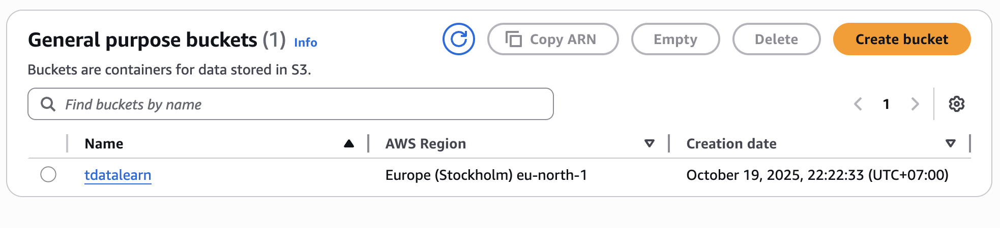

Bucket Policy
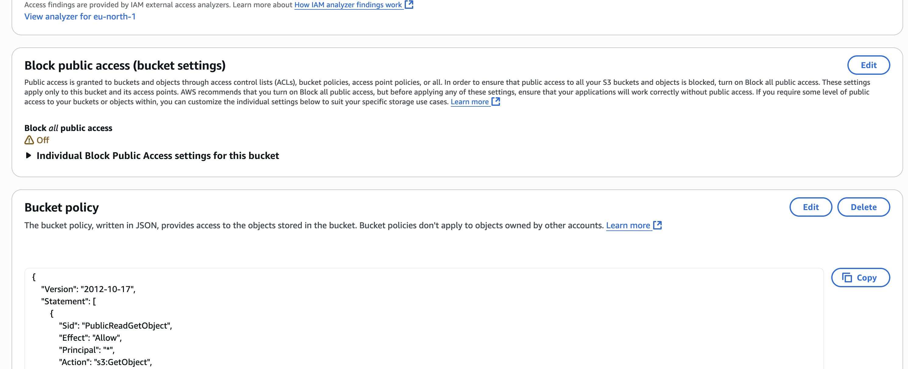

Static Website settings
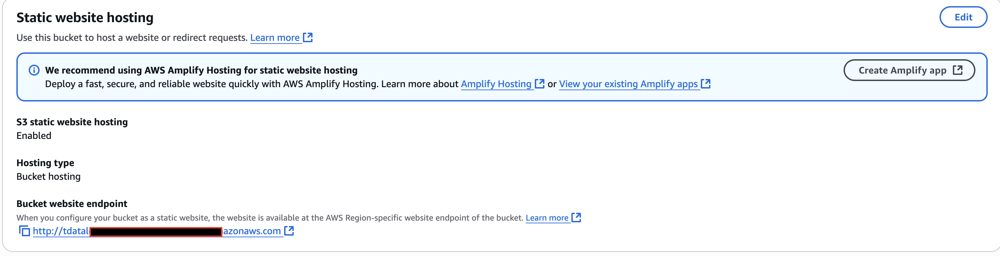

Website Index.html
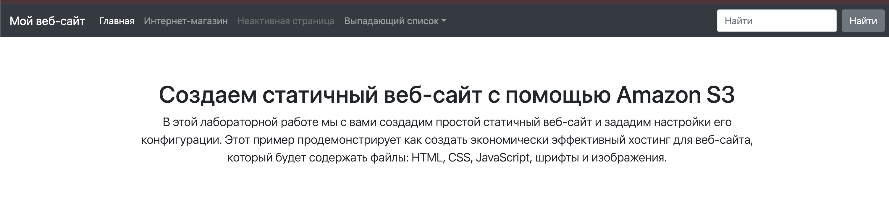

Website Error.html

Azure Blob Storage

Storage
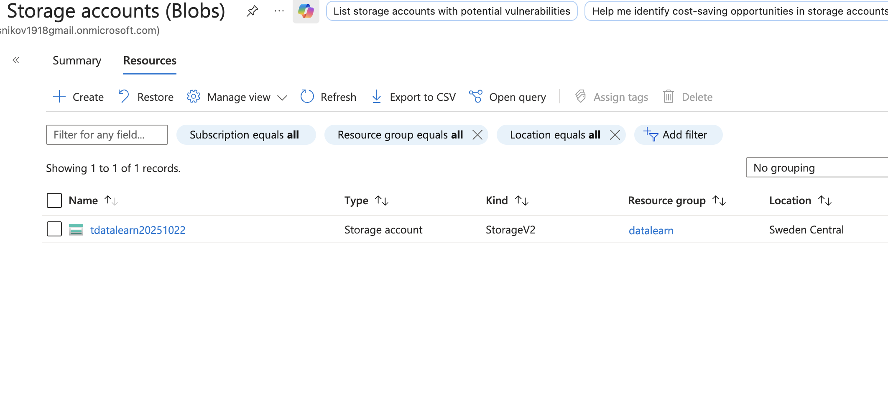

Container
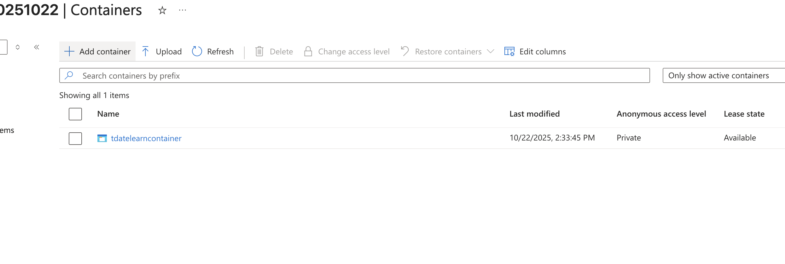

Overview container
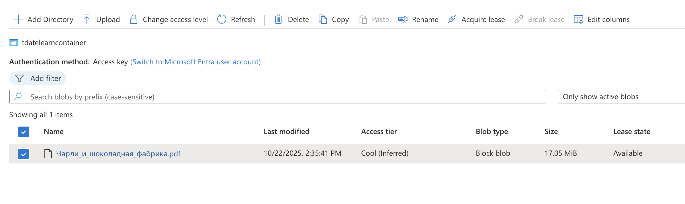

Public URI for file in container
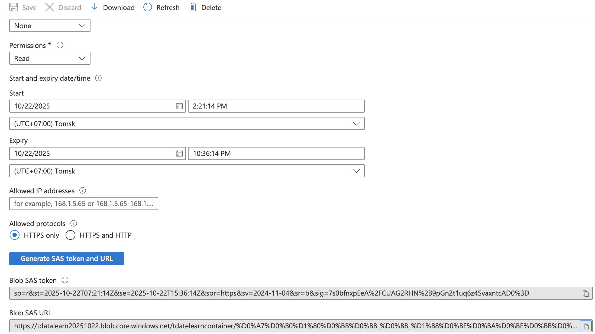

Billing Alert

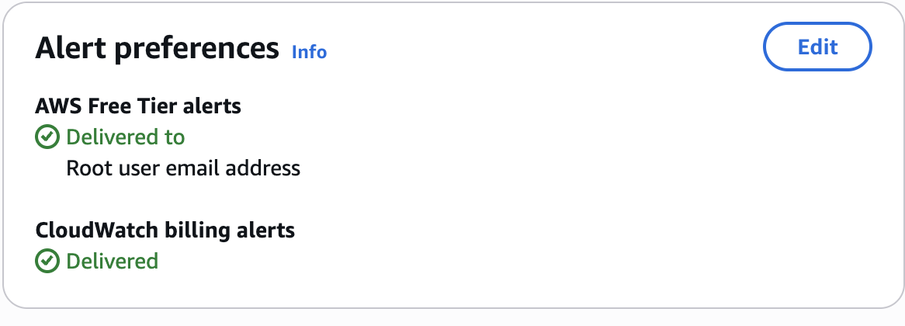

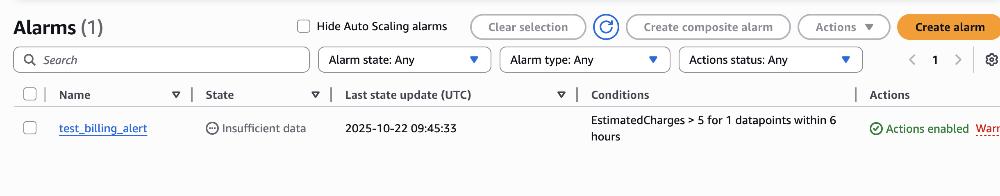

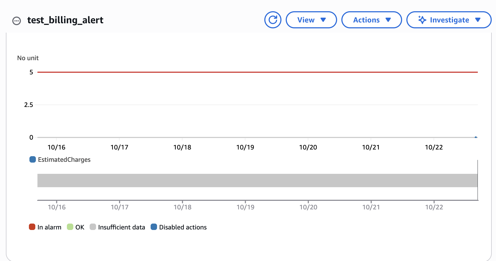

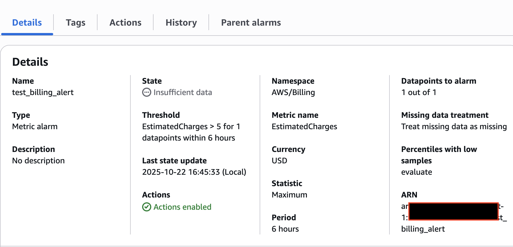

Pricing Calculator

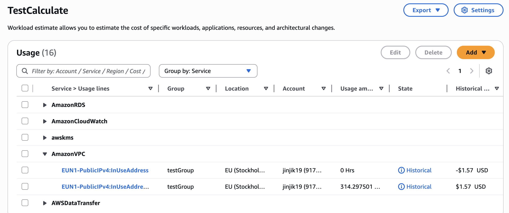

First AWS service created by cloudformation
TEMPLATE -> [HERE](./aws_template/first_temlapte.yaml)

CLOUDFORMATION PANEL
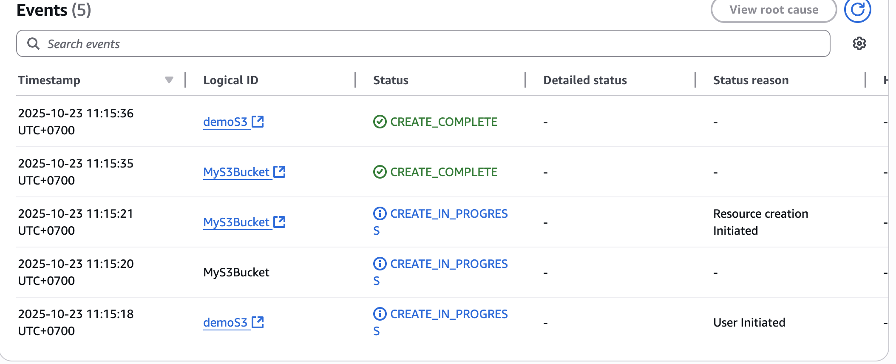

DEMO BUCKET
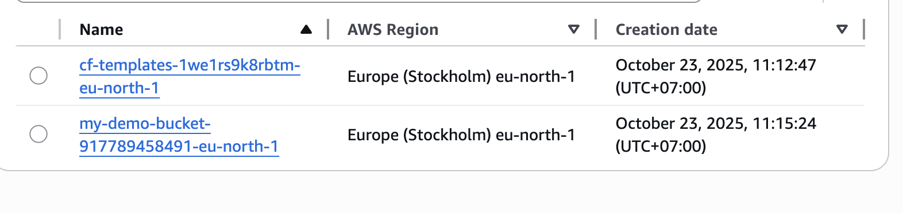

AWS 2 EC2 Instances with Load Balancer:
TEMPLATE -> [HERE](./aws_template/ec2_alb.yaml)

Infrastructure
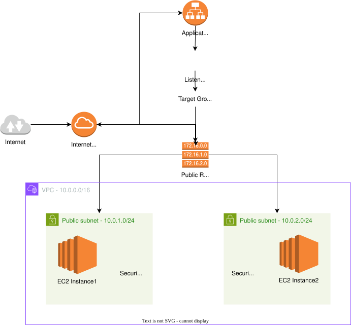

CloudFormation Stack
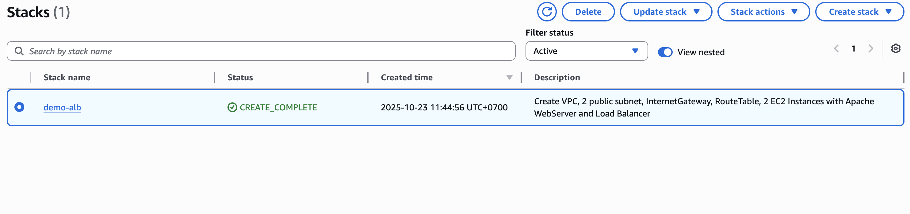

VPC
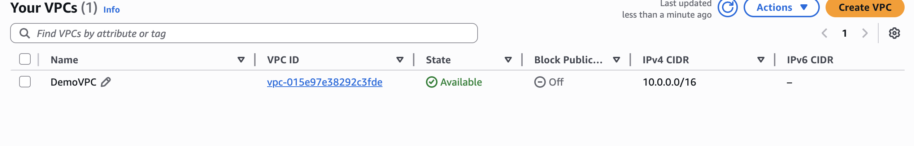

Subnets
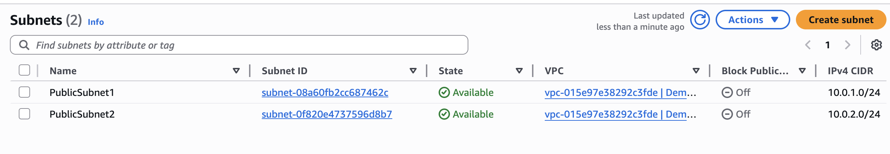

Internet Gateway
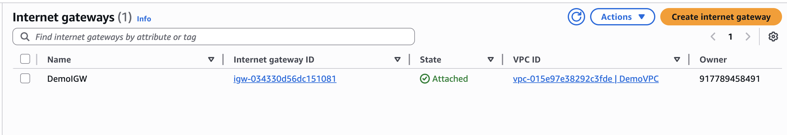

Route Tables
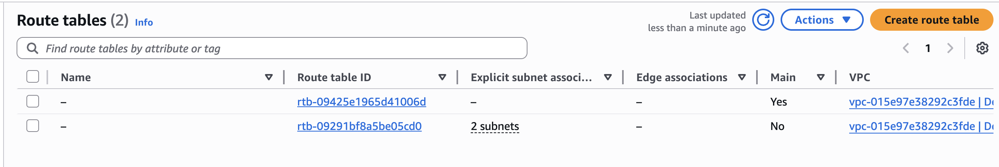

Security Group
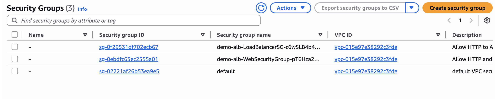

EC2 Instances
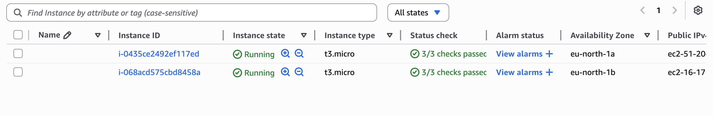

Load Balancer
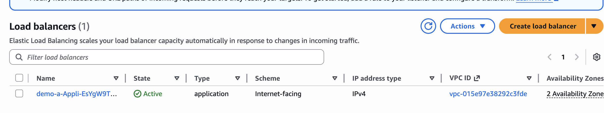

Example Website 1

Example Website 2
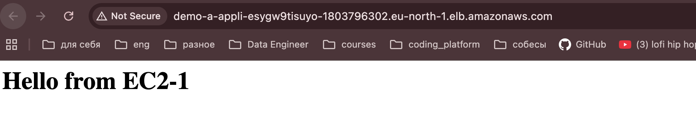

Stopped EC2 Instance2
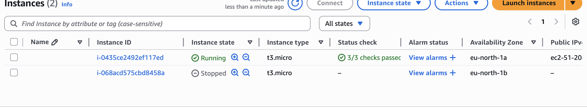

When I stopped the second instance EC2, Load Balancer use only EC2 Instance1 and response was:
Example Website 3
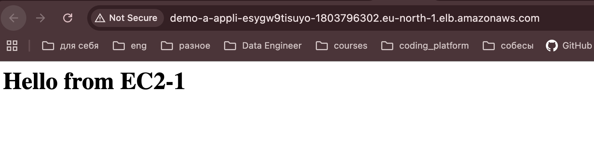